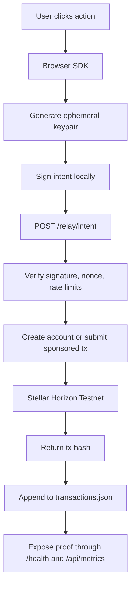

# 🧠 Architecture Documentation

## StellarBloom: Gasless Onboarding Infrastructure for Soroban

StellarBloom is a lightweight onboarding layer for Stellar and Soroban experiences. Its goal is to remove wallet setup, fee friction, and cryptographic complexity from the first user interaction while still producing real, verifiable Stellar Testnet transactions.

The current Level 6 system has two live transaction paths:

1. **Walletless intent relay** for first-time users who do not have a wallet
2. **Fee bump relay** for already-signed wallet transactions

Both paths feed a shared monitoring and indexing layer so the project can expose health, usage, and proof data for Black Belt review.

---

## 🌸 System Overview

### 1. Walletless Intent Flow

This is the primary onboarding flow used by the live demo.

1. A user clicks an action such as `claim_coffee`
2. The browser generates an ephemeral Ed25519 keypair
3. The browser signs a lightweight JSON intent locally
4. The signed intent is sent to `POST /relay/intent`
5. The relayer verifies the signature, nonce, and rate limits
6. The relayer decides whether it needs to:
   - create and fund a new testnet account, or
   - submit a sponsored payment/action for an existing account
7. Horizon returns a transaction hash
8. The relayer logs the transaction and exposes it through `/health` and `/api/metrics`

This flow is designed for onboarding, demos, and gasless first-touch experiences.

### 2. Signed XDR Fee Bump Flow

This path supports wallet-connected users and developer-facing gas sponsorship.

1. A user signs a transaction XDR in their wallet
2. The signed XDR is sent to `POST /relay`
3. The relayer wraps it in a real Stellar FeeBump transaction
4. The sponsor account pays the fee and submits it to Horizon
5. The resulting hash is returned and logged

This path is closer to a reusable infrastructure primitive for external apps that already have a signing surface.

---

## 🔁 Request Flow

---

## 🧩 Core Components

### `stellar-bloom/src/lib/bloom-sdk.ts`

The browser SDK for walletless onboarding.

- Generates a fresh ephemeral keypair
- Builds an intent payload with nonce and timestamp
- Signs the payload locally
- Sends the signed intent to the relayer

### `relayer/index.js`

The backend relayer and indexing service.

- Verifies signed intents
- Applies IP-based and per-wallet limits
- Prevents replay attacks with nonce tracking
- Creates sponsored Stellar transactions
- Supports fee bump submission for signed XDRs
- Persists transaction logs to `relayer/data/transactions.json`
- Serves `/health`, `/api/metrics`, and developer stats

### `stellar-bloom/src/stellar/stellar.ts`

The wallet-connected transaction path.

- Connects Freighter, Albedo, and xBull
- Builds Soroban transactions for signed wallet flows
- Sends signed XDRs to the relayer's `/relay` endpoint

### `relayer/export-proof.mjs`

The proof-export utility used for Level 6 evidence.

- Reads the persistent transaction log
- Produces wallet validation JSON and markdown artifacts
- Produces a Level 6 proof summary snapshot

---

## 📊 Monitoring And Indexing Architecture

StellarBloom includes a lightweight but real evidence pipeline for Black Belt review.

### Source Of Truth

- `relayer/data/transactions.json`

Every relayed transaction is appended to the persistent log with wallet, action, timestamp, and hash metadata.

### Derived Analytics

- `GET /health`
- `GET /api/metrics`
- `relayer/data/user-validation-results.json`
- `relayer/data/user-validation-table.md`
- `relayer/data/level6-proof-summary.json`

### Indexed Metrics

- total transactions
- unique wallets
- repeat wallets
- active days
- recent transactions
- action breakdown
- sponsor spend totals
- goal progress toward 30-wallet validation

---

## 🔒 Security Boundaries

The current implementation keeps the highest-risk secrets server-side and keeps user signing client-side.

- The ephemeral private key used in the walletless flow never leaves the browser
- The sponsor secret never leaves the relayer environment
- Replay protection is enforced with nonces
- Abuse is constrained with IP and per-wallet rate limits

Known limitations remain documented in [SECURITY.md](./SECURITY.md), especially the in-memory nonce and API key stores used for the current testnet deployment.

---

## ⚠️ Current Scope And Honest Limitations

StellarBloom is strong as a **production-ready testnet onboarding layer**, but it is not yet a full mainnet-grade infra stack.

Current limitations:

- The walletless demo path currently routes through sponsored relayer actions rather than a full contract-native account abstraction flow
- Nonces and per-key controls are still stored in memory
- The transaction log is JSON-backed rather than database-backed
- The default public demo deployment still uses a shared testnet API key model for ease of testing

These are acceptable for Level 6 if presented clearly, because the project already demonstrates real transactions, monitoring, indexing, documentation, and operational proof.

---

## 🌟 Outcome

StellarBloom removes the hardest part of trying a blockchain application for the first time. Instead of asking a user to install a wallet, buy XLM, and understand signing, it lets them click a single action and see a real verified result immediately.

For Level 6, the important part is that this is not just a UI demo. It is a live onboarding system with:

- a working relayer
- real sponsored testnet transactions
- proof artifacts
- usage metrics
- monitoring endpoints
- operational documentation
