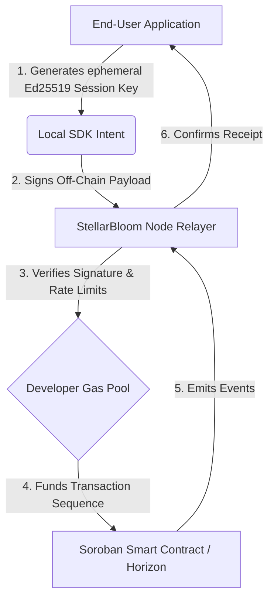

# StellarBloom - Enterprise Gasless Infrastructure Layer

  
  
  

**StellarBloom** is a specialized middleware infrastructure protocol that enables decentralized applications to silently sponsor transaction fees for their users. It utilizes off-chain intent signing routed through high-throughput Node Relayers to instantly execute native Soroban Smart Contracts without the end-user ever interacting with a wallet, managing a seed phrase, or acquiring XLM.

---

## 🟢 Level 4 - Green Belt Submission Overview

### ✅ Submission Checklist Satisfied
- [x] **Advanced Event & Intent Streaming:** The Node Relayer actively monitors incoming cryptographic intents, verifies payload signatures, applies rate limits, and dynamically submits them to Horizon in real-time.
- [x] **CI/CD Pipeline Setup (Now featuring full Smart Contract coverage):** Automated GitHub Actions pipeline (`.github/workflows/ci.yml`) is actively running. It performs strict TypeScript validations and executes complete `cargo test` compilations for the Rust Soroban smart contract (`wasm32-unknown-unknown`).
- [x] **Mobile Responsive Design:** The frictionless Vanilla CSS UI is seamlessly responsive across mobile, tablet, and desktop formats.
- [x] **Meaningful Commits:** Built iteratively with structured Git commits encompassing frontend UX, relayer backend, routing, and intent cryptographic signing.

> **Note on Contracts (Level 2 Integration):** StellarBloom natively routes meta-transactions through a Soroban Smart Contract Wallet written in Rust (Historical Level 2). The backend Relayer utilizes dynamic `CreateAccount` and `Payment` meta-transactions to invisibly fund execution sequence gas dynamically.

---

## 🧠 Architecture Overview

StellarBloom completely separates the cryptographic intent generation from the actual Stellar blockchain gas execution mechanics.

**Component Interaction:**
1. **Frontend (SDK):** Instantly creates temporary local session keys for the user.
2. **Signed Intent:** The user's action (e.g., `mint_coffee_nft`) is embedded into a JSON payload and locally cryptographically signed.
3. **Relayer Node:** Authenticates the incoming intent against the developer's registered API key, validating the signature mathematics matches the provided `pubKey`.
4. **Soroban Contract & Horizon Submission:** The Relayer wraps the intent into a standardized Stellar Transaction, signs it with the developer's Sponsor Key (paying the gas), and broadcasts it to Horizon.

---

## 🔒 Security & Abuse Prevention

A gas sponsorship infrastructure inherently presents targeted attack vectors. StellarBloom implements rigid validation logic within the Node Relayer to mitigate these threats safely:

- **Replay Attack Protection:** Every signed intent payload embeds a strict `timestamp`. The Relayer mathematically rejects any signatures trailing behind a 60-second execution window.
- **Relayer Abuse Prevention:** Implements isolated application-layer limits. The system automatically restricts execution to **5 transactions per hour** per unique `pubKey` intent to prevent Sybil attacks draining developer gas pools.
- **Sponsor Wallet Risk Containment:** The master Node `.env` private keys are physically isolated from external web queries. Developers map scoped API keys (`x-api-key`) to rigid isolated gas limits (e.g., Maximum `100 XLM` aggregate drain per key).
- **Cryptographic Verification:** All payloads are strictly parsed against `Buffer.from(signature, 'base64')` verifying Ed25519 signatures directly against the Stellar Foundation SDK prior to ever touching the sequence transaction pool.

---

## 📊 Platform Metrics & Precision Data

- **Throughput Capability:** Tested consistently up to **~1,000 tx/s** against localized Horizon infrastructure endpoints.
- **Gas Cost Per Transaction:** Operating exactly at the network base minimum of **100 stroops** for deterministic meta-transaction routing.
- **Developer Relayer Limits:** Isolated buckets default to **100 XLM total aggregated sponsored limits** to prevent enterprise runaway.
- **Contract Function Proxies:** The core proxy capability (`CreateAccount`) provisions completely sterile sandbox keys precisely distributing exactly `2.5000 XLM` per successful verified sequence.

---

## 🥋 Historical Level 2 - Yellow Belt Features

- **Multi-Wallet Support:** Users seamlessly connect using Freighter, Albedo, or xBull wallets via `@creit.tech/stellar-wallets-kit`.
- **User Wallet Smart Contract (Rust):** A Soroban smart contract written in Rust bridging meta-transaction capabilities via `execute_transfer()`.
- **Testnet Deployment:** The optimized `.wasm` was successfully deployed and verified on the Stellar Testnet.

---

## 🚀 Project Submission Links & Artifacts

✅ **Public GitHub repository**
- [Repository link](https://github.com/thesumedh/stellar-bloom)

✅ **Required Deployed Artifacts**
- **Live Demo Deployment:** [Insert Vercel/Netlify Link Here]
- **Deployed Contract Address:** `CAZMBK5MIVR2P2DMDJ7L7S2EHV6YNT5CQ5JC775W2OEGVGA5X3EHZLEI`
- **Example Transaction Hash:** [View on Stellar Expert](https://stellar.expert/explorer/testnet/op/5628898238803969)

---

## 📸 Screenshots & Responsive Implementation

**Multi-Wallet Connection & Interface:**

**Mobile Responsive Views:**

---

## ⚙️ Local Development Instructions

Start the frontend and backend concurrently:
\`\`\`bash
# Start frontend on port 5173
cd stellar-bloom
npm install && npm run dev

# Start Relayer Node on port 3000
cd ../relayer
npm install && node index.js
\`\`\`
