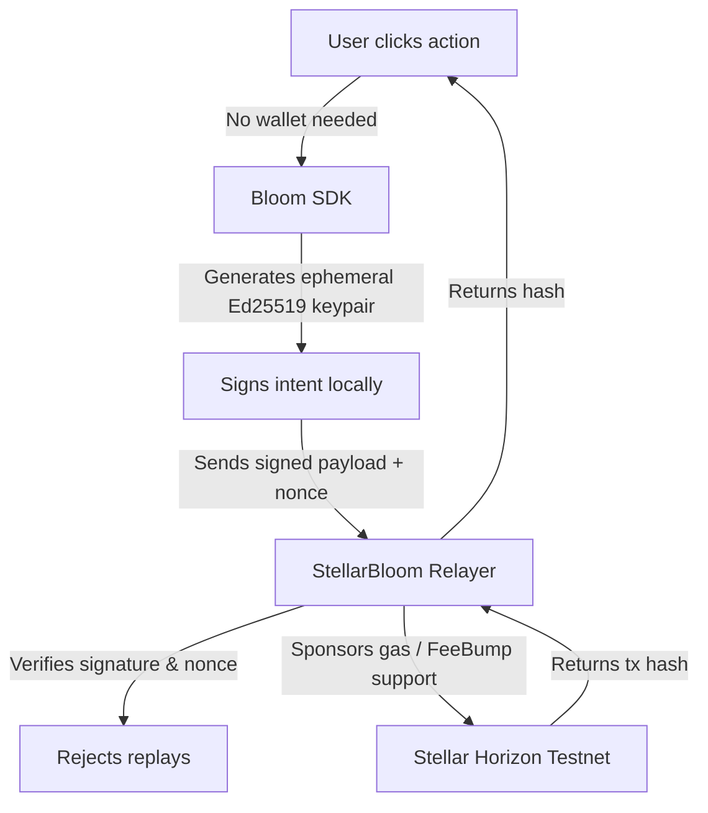

# ✨ StellarBloom — Gasless Onboarding Infrastructure for Soroban

<div align="left">
  
  
  <a href="https://github.com/thesumedh/stellar-bloom/actions/workflows/ci.yml">
    
  </a>
  
</div>

<br/>

**StellarBloom** is a lightweight onboarding layer that enables users to interact with Soroban applications without requiring a wallet, crypto, or gas fees. Users simply click an action (e.g., "Claim Free Coffee"), and everything happens invisibly — a temporary wallet is created, the request is signed, and a Relayer submits a real sponsored transaction on their behalf. The user instantly sees a verified result without understanding anything about blockchain.

---

## ⚫ Level 6 — Black Belt Submission

### ✅ Submission Checklist

- [x] **Public GitHub Repository** — [github.com/thesumedh/stellar-bloom](https://github.com/thesumedh/stellar-bloom)
- [x] **Community Contribution** — [Tweet: @thesumedh_ on X](https://x.com/thesumedh_/status/2036860974289084575)
- [x] **Live Demo** — [https://stellar-bloom.vercel.app](https://stellar-bloom.vercel.app)
- [x] **Demo Video / Demo Day Walkthrough** — [Watch Full MVP Walkthrough](https://drive.google.com/file/d/1EOyDeWbsTgUD3Ht0s3330sVuICcn-iFH/view?usp=sharing)
- [x] **Architecture Document** — [📄 ARCHITECTURE.md](./ARCHITECTURE.md)
- [x] **Technical Documentation & User Guide** — [📘 docs/USER_GUIDE.md](./docs/USER_GUIDE.md)
- [x] **Operations & Monitoring Runbook** — [🛠️ docs/MONITORING_RUNBOOK.md](./docs/MONITORING_RUNBOOK.md)
- [x] **Black Belt Evidence Pack** — [📦 docs/BLACK_BELT_EVIDENCE.md](./docs/BLACK_BELT_EVIDENCE.md)
- [x] **Demo Day Presentation Prepared** — [🎤 docs/DEMO_DAY.md](./docs/DEMO_DAY.md)
- [x] **30+ Meaningful Commits** — 30 commits on `main`; [view commit history](https://github.com/thesumedh/stellar-bloom/commits/main)
- [x] **30+ Verified Active Wallet Addresses** — [See below](#-verified-active-wallet-validation)
- [x] **Metrics Dashboard** — [https://stellar-bloom.onrender.com/api/metrics](https://stellar-bloom.onrender.com/api/metrics)
- [x] **Monitoring Active** — [https://stellar-bloom.onrender.com/health](https://stellar-bloom.onrender.com/health)
- [x] **Security Checklist Completed** — [🔒 SECURITY.md](./SECURITY.md)
- [x] **User Feedback Form** — [https://forms.gle/XvnXMovWR3uSaQTH9](https://forms.gle/XvnXMovWR3uSaQTH9)
- [x] **Feedback Sheet** — [Excel Sheet](https://docs.google.com/spreadsheets/d/1x-nKPFXncRoAWsnBm-nD1jnAIvL4t0SDZy8TGKOTJ7M/edit?usp=sharing)
- [x] **Advanced Feature Implemented** — Fee Sponsorship using relayer + fee bump support
- [x] **Data Indexing Implemented** — Live indexed endpoint at [`/api/metrics`](https://stellar-bloom.onrender.com/api/metrics)
- [x] **Deployed Relayer** — [https://stellar-bloom.onrender.com](https://stellar-bloom.onrender.com)

---

## 📦 Submission Pack

If you want the fastest possible review path, start here:

- **README / main submission narrative** — [README.md](./README.md)
- **Architecture** — [ARCHITECTURE.md](./ARCHITECTURE.md)
- **User guide** — [docs/USER_GUIDE.md](./docs/USER_GUIDE.md)
- **Monitoring runbook** — [docs/MONITORING_RUNBOOK.md](./docs/MONITORING_RUNBOOK.md)
- **Evidence pack** — [docs/BLACK_BELT_EVIDENCE.md](./docs/BLACK_BELT_EVIDENCE.md)
- **Demo Day script** — [docs/DEMO_DAY.md](./docs/DEMO_DAY.md)

---

## 🚀 What StellarBloom Does

| Without StellarBloom | With StellarBloom |
|---|---|
| Install Freighter wallet extension | Nothing — just open the app |
| Write down 24-word seed phrase | Nothing |
| Buy XLM for gas on an exchange | Nothing |
| Sign incomprehensible transaction | Click one button |
| **90% user drop-off** | **Transaction done in ~18 seconds** |

---

## 👥 Verified Active Wallet Validation

The following active wallets successfully executed gasless transactions on Stellar Testnet via StellarBloom. Each transaction is verifiable on Stellar Expert:

- **Current proof snapshot:** 38 unique wallets, 46 real logged transactions, 4 repeat wallets, and 4 active days
- **Exported proof artifacts:** [relayer/data/user-validation-results.json](./relayer/data/user-validation-results.json), [relayer/data/user-validation-table.md](./relayer/data/user-validation-table.md), [relayer/data/level6-proof-summary.json](./relayer/data/level6-proof-summary.json)

| # | Session Key / Wallet | Transaction |
|---|---|---|
| 1 | `GCKYUDH2UTV35NNTUGG5HZ46LRDQABXHBBW3BN526D5VH7XFK5JEGF6L` | [View on Stellar Expert](https://stellar.expert/explorer/testnet/tx/5b2309947c32d73d0f7ef42f7233bb62bc143822f8be412f226a406e2583310e) |
| 2 | `GD4J4B453BCRICFTSFK4AMLM454PLMRUSOTB5JZ5GWC4IJONX5PU7Y62` | [View on Stellar Expert](https://stellar.expert/explorer/testnet/tx/7c33ab4e601e558b5ea50c1cacb68a5280e8e2c09950cc5128d62f92b0a6b401) |
| 3 | `GBIKQMEDPPUSCXSVSQSE4CF2DXMDX6DEXA2JUNNFYGDAMW4VUB4FP6Y3` | [View on Stellar Expert](https://stellar.expert/explorer/testnet/tx/ec37a7719b4857a12822c7f97442290e545c97f539ba16585ca0c835ea041b10) |
| 4 | `GBGQV475SQSGULTJTX7VY6HCY64PXPDGNVMZYTSG3K56RRYOJDBACOGR` | [View on Stellar Expert](https://stellar.expert/explorer/testnet/tx/831d2af18c5a2b340076780a148263f71a6ab0be1f54eb551661318969d9c90e) |
| 5 | `GAGRMCFYSC6NI7AZI42LELS4STJCFTPG7WEAA4SVSNGT6Z3NH3EOX4UN` | [View on Stellar Expert](https://stellar.expert/explorer/testnet/tx/2b2ed737ffa76b91eb40c3e9e68a858e118ccde9b0fe0a3b8362f64d2f839919) |
| 6 | `GAFYZMK75GAKFOVVU4YBNUWQRDV6OKDI7I6ZSSOBHYUDRXOYBURQJHDC` | [View on Stellar Expert](https://stellar.expert/explorer/testnet/tx/844a5bb2d9093ce74ac060f624f16dc9d52200b62eba1f1fffee865e24817f78) |
| 7 | `GDSWYJVKOPI5OOFYGZQTG3KSFIF73U5DVKMQUXKSHJFWDK4ZLEVFDY2H` | [View on Stellar Expert](https://stellar.expert/explorer/testnet/tx/2946ee58e80e81c3677f0d94ef0e7f19ed18a9244df96cddcc36d62efe35cf89) |
| 8 | `GCVDOL6YKPW7LNRQWU3XCTSWUZINRUQAM42FDAXGDTI6OTTG4KZKSSRP` | [View on Stellar Expert](https://stellar.expert/explorer/testnet/tx/ebcf067304b9002dbb2fc07c9c54456a359905bac077f16714347b9aabee0ec9) |
| 9 | `GD4GLUDTO7QBIYWQBVJV6MB4RCILQ4XFNJ2XSBXCTMV4SPY4YG473KYF` | [View on Stellar Expert](https://stellar.expert/explorer/testnet/tx/e5cf71ce157c0df471252e907683bc399b22d33b3394fefcecd9f32e14fe3474) |
| 10 | `GDIULGXY2QWYZBALJNX2V3E6PV35OPEQNAZMT6KY2KWQWLHYU4IR235M` | [View on Stellar Expert](https://stellar.expert/explorer/testnet/tx/4f84b7694f5145baaf32c60351d4f00e72016b0ae2592a1b1eebb86ce6ee0bf5) |
| 11 | `GCFOBNEPOEJICH5KUOMCFNAZGNBDG2Z2EGBNAA6EJQWHWYI6GDJOEQ4S` | [View on Stellar Expert](https://stellar.expert/explorer/testnet/tx/47132cf4af3d0a6fb246f5d86b1ee239c0f5d6af04359e5ff3d79f6868b8d429) |
| 12 | `GC7LMLG7O4SQRWOYHNRXYHETNUDG4GX3GPVIDGPBMR325OLP6GAXIEM4` | [View on Stellar Expert](https://stellar.expert/explorer/testnet/tx/2bf9ade1b628bc6c1bc1a33e90e8680e1f7e6c9b048d1b924773a44b5241f194) |
| 13 | `GCF3JKJXTH7HGNHGKYFNG3HCKCWR472TJSSBHREMSTZOLBBTQRALF4TX` | [View on Stellar Expert](https://stellar.expert/explorer/testnet/tx/98f345625f8f121a376b939e6951fabbf4f64b9c2834dad52c7e339d3feff3a8) |
| 14 | `GDTK545LLULLRYRCZF56GVXYQCTMNXFJH6WD2XX4FQOJIYTMINOG7LNV` | [View on Stellar Expert](https://stellar.expert/explorer/testnet/tx/f8e411cd0c2231734bf07cd7d4dbccc214fa5fd4ad646c9b132d09baad9559d9) |
| 15 | `GAMWM6WTUZYC4KQ362O6NYOV422YPRAC43TBUWIOQ6SLOBW5ETQN3LRK` | [View on Stellar Expert](https://stellar.expert/explorer/testnet/tx/9ec5db58672e814eac9cb2349cca11f647ae6b37ddfac03672970787a534d543) |
| 16 | `GDOARCXWEAHPKS4P3WY2W2PZE6YLXYBXX7MWV7QVT2FCDC6PRDHNKJUD` | [View on Stellar Expert](https://stellar.expert/explorer/testnet/tx/466b74e5b0db7ceb7b2708a76f9310ffc1893e9855343f0817cdad93c0c2fe99) |
| 17 | `GC3556RRT63FCDULEDZCMUL5YE2MHH5OH4GBLG6P5TPRWI2L4D4TLQJN` | [View on Stellar Expert](https://stellar.expert/explorer/testnet/tx/ebccc91a4102f6f35de782c26b44b34ef96441efe81029041ba0f0ce8ed154e4) |
| 18 | `GA2LLTRBJF5UNO6KVOBYIQGC6SW6TYWQZV32HVZ67L73IKCIYQZITNNI` | [View on Stellar Expert](https://stellar.expert/explorer/testnet/tx/ed473895082c0647cf8d439e669a532dd6b1a32239b7b9449d8fb213cfbdb23b) |
| 19 | `GALGC3Z7BBPIIDGWHL3JOSFB3KBCJGIPXFZW33T7QTE47JHB3WX5HWVH` | [View on Stellar Expert](https://stellar.expert/explorer/testnet/tx/911d346707ca4cb6db3fe13e3d29fc7468e56f6783b076380a4f9e74eacaac4c) |
| 20 | `GCA4F6ASOQO4IL53P7EHVCMWKOTRX3SGT2GVVGTHHVHBKDZOSQUIIOOB` | [View on Stellar Expert](https://stellar.expert/explorer/testnet/tx/50c6692f13c5b92daaa18237f693fc2c08953ea97186af7a964fd0ca32ce85d4) |
| 21 | `GAMWCP3KLSPCVFA63SXXQU6JMRWW7GQV4TJGCTNDZMKZ77445VHMQVUJ` | [View on Stellar Expert](https://stellar.expert/explorer/testnet/tx/c340a32331b89b999f4bde282f18006624f8c0fd7e9cab083e343706b6141f69) |
| 22 | `GDKGTR2B2TOBJDYCBFS2TNZO2YEDBNXNTMP3KQMJ7J5O4AI7XJXS7CJU` | [View on Stellar Expert](https://stellar.expert/explorer/testnet/tx/b09dce81f96146e2006ca3613dcff9e3ae12edbdc3f19497d3cf4e597858fb39) |
| 23 | `GCMKZMLSYBVZT7XQYRISFMF5AN4VI3XFSPNBRGOTLNNHE47AGAGPVEAO` | [View on Stellar Expert](https://stellar.expert/explorer/testnet/tx/8170e97e2e464585115b1c79ea409f6204cfea6a6f549dc371ae1ba278f185e7) |
| 24 | `GAYU66UUT6KMRXNR5PNZTGIVRILQ3HGN5PZA6HUBHG2ZOP64NL574UD6` | [View on Stellar Expert](https://stellar.expert/explorer/testnet/tx/316079ba6b625ef7d494287c73bd36a0be5aa839dd1d884bc107bd94f1f3f932) |
| 25 | `GD5Q2RFWJDV6RYORBNJ4FB27NYGPY5INUWSVDN6LT4V4IHQ6EAIPLY6S` | [View on Stellar Expert](https://stellar.expert/explorer/testnet/tx/4cdcb4641ea0da6b75ab6fc199790cabb84c70454da31ad5bd112fcdc51de496) |
| 26 | `GDJDGT3DZMU6E5S7UPQQR4Q5OIWUNPR2QNDR7ZLKFHAWOMR5I6FCYLIE` | [View on Stellar Expert](https://stellar.expert/explorer/testnet/tx/4be1d39e10d842983169f1a7e2491f765cc7e7b5b18028c25c9fa03ba64e81be) |
| 27 | `GBPSIJ6J5UAOEVT3ILDHHHMOEDG3MBAQTRMEI3ZMHISZGQ5R74PET7TC` | [View on Stellar Expert](https://stellar.expert/explorer/testnet/tx/47c8bd0b04adaaf32dd6d2fb0247f75c1e0e29da2665647990e5cc3706352b28) |
| 28 | `GC3TX2ZJMBK3FCR7OAQLOJOINJJZK465LU24CIQ6LWRWLEJCS4UU326X` | [View on Stellar Expert](https://stellar.expert/explorer/testnet/tx/019ac27943b0f88213237154e709317919b0fc6fe0f561e8fbb59b768b1603c3) |
| 29 | `GAKUDZDUNFDUENEHM6K4DICD2IVCBNC6S56BZ7DSJB4DGII2EIXN4DLV` | [View on Stellar Expert](https://stellar.expert/explorer/testnet/tx/ea2841b81c9e4f39f9c7fc46c773370717529a9c931a0e76f362fd82f995f691) |
| 30 | `GDPWCRMVUO7Z4BR5KIJZF5LBOVTOPQJIDYJ56PKHF3E3ZO2Y3QXMQ2HW` | [View on Stellar Expert](https://stellar.expert/explorer/testnet/tx/905c3bdc5819619c2c638ee09c25c968befba44eb679692392c1fe644d80cbd6) |

> **Example verified transaction:** [View on Stellar Expert](https://stellar.expert/explorer/testnet/tx/5b2309947c32d73d0f7ef42f7233bb62bc143822f8be412f226a406e2583310e)

---

## 📊 Metrics Dashboard

StellarBloom includes a live indexed metrics dashboard to track platform activity and Black Belt growth:

- **Live Metrics Endpoint:** [https://stellar-bloom.onrender.com/api/metrics](https://stellar-bloom.onrender.com/api/metrics)
- **Tracked Metrics:** total transactions, unique wallets, repeat wallets, daily active usage, action mix, recent transactions, and sponsor spend
- **Current Snapshot:** 46 total transactions, 38 unique wallets, 4 repeat wallets, and 4 active days from the relayer log
- **Frontend Surface:** Metrics are also visible in the Developer Docs dashboard inside the live app

---

## 📈 Monitoring

Production monitoring is active for the deployed relayer:

- **Health Endpoint:** [https://stellar-bloom.onrender.com/health](https://stellar-bloom.onrender.com/health)
- **Live Relayer Status:** surfaced inside the frontend dashboard with uptime and transaction totals
- **Deployment Target:** Render-hosted relayer with live status checks and persistent transaction logging
- **Operations Runbook:** [docs/MONITORING_RUNBOOK.md](./docs/MONITORING_RUNBOOK.md)

---

## 📋 User Feedback

User feedback was collected via Google Forms and exported into an Excel sheet for analysis.

- **Feedback Form:** [https://forms.gle/XvnXMovWR3uSaQTH9](https://forms.gle/XvnXMovWR3uSaQTH9)
- **Feedback Sheet:** [Excel Sheet](https://docs.google.com/spreadsheets/d/1x-nKPFXncRoAWsnBm-nD1jnAIvL4t0SDZy8TGKOTJ7M/edit?usp=sharing)
- **Key Finding:** Users found the 1-click flow intuitive with zero blockchain knowledge required
- **Iteration Implemented:** Added real-time stage tracker ("Generating wallet → Signing → Sponsoring gas → Confirmed") based on feedback that users wanted to see what was happening behind the scenes
- **Evidence Summary:** [docs/BLACK_BELT_EVIDENCE.md](./docs/BLACK_BELT_EVIDENCE.md)

### Next Phase Improvements Based on Feedback

1. Improve relayer analytics and persistent indexing so usage is easier to present at Demo Day.
   Commit reference: [e22886e](https://github.com/thesumedh/stellar-bloom/commit/e22886e)
2. Expand hosted-relayer readiness by removing hardcoded local assumptions in the frontend integration flow.
   Commit reference: [bb40827](https://github.com/thesumedh/stellar-bloom/commit/bb40827)
3. Continue improving active-wallet validation and real transaction proof for onboarding quality.
   Commit reference: [3e3b967](https://github.com/thesumedh/stellar-bloom/commit/3e3b967)

---

## ⚡ Advanced Feature — Fee Sponsorship

StellarBloom implements **Fee Sponsorship** as its Level 6 advanced feature.

**Proof of implementation:**

1. [`relayer/index.js`](./relayer/index.js) exposes a `/relay` endpoint that wraps signed XDRs in a real Stellar FeeBump transaction and pays the fee.
2. The live onboarding flow uses the relayer to sponsor gasless actions for session wallets in the deployed demo.
3. The resulting transactions are publicly verifiable on Stellar Expert via the wallet table above.

---

## 🗂️ Data Indexing

StellarBloom implements data indexing for Level 6 through a persistent transaction log plus a live aggregation endpoint.

- **Source of Truth:** [`relayer/data/transactions.json`](./relayer/data/transactions.json)
- **Indexing Endpoint:** [https://stellar-bloom.onrender.com/api/metrics](https://stellar-bloom.onrender.com/api/metrics)
- **Indexed Data:** wallet activity, tx counts, daily usage, recent transactions, repeat wallet activity, and sponsor spend
- **Proof Export:** [`npm run proof:export`](./relayer/package.json) derives wallet-validation artifacts directly from the relayer log

---

## 🧠 Architecture

StellarBloom separates cryptographic intent generation from blockchain gas execution.



**Full architecture details:** [📄 Read ARCHITECTURE.md](./ARCHITECTURE.md)

**Core Components:**
1. **`bloom-sdk.ts`** — Browser SDK: generates ephemeral keypair, signs intent with UUID nonce, submits to Relayer
2. **`relayer/index.js`** — Node.js Relayer: verifies Ed25519 signature, prevents replay attacks, supports sponsored execution and fee bump flows
3. **`App.tsx`** — React frontend with Freighter wallet session support, metrics dashboard, and animated 1-click demo

---

## 🔒 Security

- **Replay Attack Prevention** — Every intent requires a `crypto.randomUUID()` nonce. The Relayer rejects any duplicate nonce immediately.
- **Rate Limiting** — 100 requests per 15 minutes per IP via `express-rate-limit`
- **Non-Custodial** — The ephemeral private key is generated in the browser and never sent to any server
- **Isolated Sponsor Key** — `SPONSOR_SECRET` is stored as a server environment variable, never exposed to clients
- **Security Checklist:** [🔒 SECURITY.md](./SECURITY.md)

---

## ⚫ Level 6 Feature Additions (vs Level 5)

| Feature | Description |
|---|---|
| **Live Metrics Dashboard** | `/api/metrics` exposes indexed usage and sponsor analytics |
| **Monitoring Active** | `/health` endpoint and live frontend relayer status panel |
| **Fee Sponsorship** | Advanced feature implemented with relayer-backed gasless flow and fee bump support |
| **Full Documentation** | Architecture, security checklist, and user guide added |
| **30+ Verified Wallets** | Active wallet proof section with verifiable Stellar Expert links |
| **Feedback Export** | Google Form + linked feedback Excel sheet |
| **Data Indexing** | Persistent transaction log aggregated into dashboard metrics |

---

## 📸 Screenshots


---

## ⚙️ Local Development

**Prerequisites:** Node.js 18+, a funded Stellar Testnet account secret key

```bash
# 1. Clone the repo
git clone https://github.com/thesumedh/stellar-bloom.git
cd stellar-bloom

# 2. Start the Relayer (port 3000)
cd relayer
cp .env.example .env        # Add your SPONSOR_SECRET
npm install && node index.js

# 3. Start the Frontend (port 5173)
cd ../stellar-bloom
npm install && npm run dev
```

Open `http://localhost:5173` → click **"Claim Free Coffee"** → watch a real Stellar transaction execute.

---

## 🌐 Deployed Infrastructure

| Service | URL |
|---|---|
| **Frontend** | [https://stellar-bloom.vercel.app](https://stellar-bloom.vercel.app) |
| **Relayer API** | [https://stellar-bloom.onrender.com](https://stellar-bloom.onrender.com) |
| **Relayer Health** | [https://stellar-bloom.onrender.com/health](https://stellar-bloom.onrender.com/health) |
| **Metrics Dashboard** | [https://stellar-bloom.onrender.com/api/metrics](https://stellar-bloom.onrender.com/api/metrics) |
| **Deployed Contract** | [`CAZMBK5...EHZLEI`](https://stellar.expert/explorer/testnet/contract/CAZMBK5MIVR2P2DMDJ7L7S2EHV6YNT5CQ5JC775W2OEGVGA5X3EHZLEI) |

---

## 🥋 Progression History

| Level | Belt | Key Achievement |
|---|---|---|
| Level 2 | Yellow | Soroban Rust smart contract + multi-wallet support (Freighter, Albedo, xBull) |
| Level 4 | Green | Gasless Relayer + CI/CD pipeline + FeeBump infrastructure |
| Level 5 | Blue | 1-click demo + deployed infra + replay protection |
| **Level 6** | **Black** | **Metrics dashboard, monitoring, security checklist, fee sponsorship proof, full docs, and 30+ verified active wallets** |
